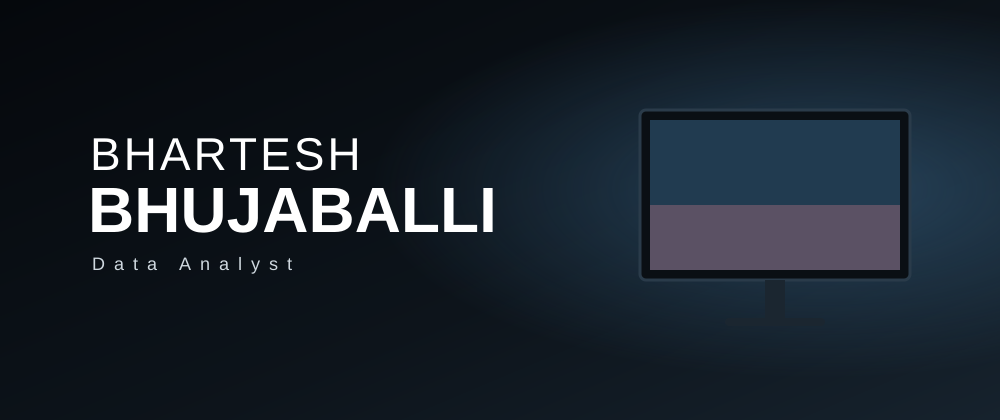

 

---

### About
ISE student at City Engineering College, Bengaluru (2023–2027), building a career in data analytics. I turn raw data into clear, useful insights.

### Skills

### Experience
**Data Science Intern**, Prodigy InfoTech (Mar–Apr 2026)
